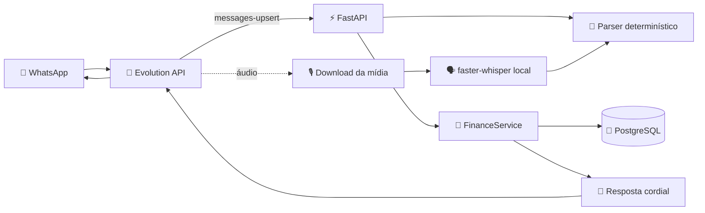

<div align="center">

# 💰 Cofrin IA

### Seu assistente financeiro pessoal no WhatsApp

Registre gastos, receitas e formas de pagamento conversando naturalmente — sem planilhas complicadas e sem perder o controle do seu dinheiro.

[](https://www.python.org/)
[](https://fastapi.tiangolo.com/)
[](https://www.postgresql.org/)
[](https://www.docker.com/)
[](https://github.com/EvolutionAPI/evolution-api)

</div>

---

## ✨ O que é o Cofrin?

O **Cofrin IA** é um assistente financeiro brasileiro desenvolvido para funcionar dentro do WhatsApp. A proposta é tornar o registro financeiro tão simples quanto enviar uma mensagem para alguém:

> `Gastei R$ 127,50 no Mercado no cartão Nubank`

O Cofrin identifica automaticamente:

- 💸 tipo da movimentação: despesa ou receita;
- 💰 valor no padrão brasileiro;
- 📝 descrição e estabelecimento;
- 🗂️ categoria financeira;
- 💳 forma de pagamento;
- 📅 data do lançamento;
- 📱 usuário associado ao telefone do WhatsApp.

A confirmação retorna de forma clara, cordial e acolhedora:

```text
✅ Despesa registrada com sucesso!

💰 Valor: R$ 127,50
🍽️ Categoria: Alimentação
📝 Descrição: Mercado
💳 Pagamento: Cartão Nubank
📅 Data: hoje

Tudo certo por aqui 😊
```

---

## 🧭 Status do projeto

| Área | Estado |
|---|---:|
| Registro de despesas e receitas | ✅ Implementado |
| Categorias automáticas | ✅ Implementado |
| Identificação de Pix, dinheiro, crédito, débito e cartões | ✅ Implementado |
| Usuários por telefone | ✅ Implementado |
| Persistência PostgreSQL | ✅ Implementado |
| Idempotência por mensagem WhatsApp | ✅ Implementado |
| Consultas de quantidade e lançamentos recentes | ✅ Implementado |
| Integração Evolution API | ✅ Implementado |
| Transcrição local com faster-whisper | ✅ Implementado |
| Relatórios mensais completos | 🚧 Próxima etapa |
| Leitura de PDF de nota fiscal | 🚧 Próxima etapa |
| Orçamentos e metas | 🚧 Próxima etapa |
| Hermes Agent no fluxo de produção | 🚧 Planejado |

---

## 🏗️ Arquitetura



### Princípios importantes

1. **O backend é a fonte oficial dos dados.**
2. **A interpretação nunca grava diretamente no banco.**
3. **Perguntas de consulta não são tratadas como lançamentos.**
4. **Eventos do WhatsApp são idempotentes por ID da mensagem.**
5. **Segredos ficam fora do código e fora do Git.**
6. **Erros internos são registrados nos logs, mas nunca expostos ao usuário.**

---

## 🗂️ Estrutura do projeto

```text
finance-whatsapp-assistant/
├── app/
│   ├── application/
│   │   └── graph.py              # Fluxo LangGraph
│   ├── domain/
│   │   └── transactions.py       # Parser e regras financeiras
│   ├── infrastructure/
│   │   └── repository.py         # PostgreSQL/SQLite e idempotência
│   ├── integrations/
│   │   └── audio.py              # Evolution + faster-whisper
│   ├── services/
│   │   └── finance.py            # Casos de uso e respostas
│   └── main.py                   # FastAPI e webhooks
├── tests/
│   ├── test_audio.py
│   ├── test_finance_service.py
│   ├── test_transactions.py
│   └── test_webhooks.py
├── Dockerfile
├── docker-compose.yml
├── Caddyfile
├── pyproject.toml
├── uv.lock
├── .env.example
└── .env.production.example
```

---

## 🚀 Executando localmente

### Pré-requisitos

- Python 3.11 ou superior;
- [uv](https://docs.astral.sh/uv/);
- Docker opcionalmente, para executar PostgreSQL local;
- uma instância Evolution API caso queira testar o WhatsApp.

### Instalação

```bash
git clone https://github.com/DevFbz/CofrinIA---Agente-Financeiro.git
cd CofrinIA---Agente-Financeiro
uv sync --group dev
```

Crie o arquivo de ambiente local:

```bash
cp .env.example .env
```

No Windows PowerShell, use:

```powershell
Copy-Item .env.example .env
```

Para rodar os testes:

```bash
uv run python -m pytest -q
```

Para iniciar a API:

```bash
uv run uvicorn app.main:app --reload
```

Verifique a aplicação:

```bash
curl http://localhost:8000/health
```

Resposta esperada:

```json
{"status":"ok"}
```

### Testando sem WhatsApp

```bash
curl -X POST http://localhost:8000/api/process \
  -H "Content-Type: application/json" \
  -d '{"message":"Gastei R$ 42,50 no almoço via Pix","phone":"5511999999999"}'
```

Exemplo de consulta:

```bash
curl -X POST http://localhost:8000/api/process \
  -H "Content-Type: application/json" \
  -d '{"message":"Quantas despesas eu tenho?","phone":"5511999999999"}'
```

---

## 🐳 Produção com Docker Compose

Copie o modelo de produção e substitua todos os valores de exemplo:

```bash
cp .env.production.example .env
```

Defina, no mínimo:

```env
POSTGRES_USER=finance
POSTGRES_PASSWORD=uma-senha-forte
POSTGRES_DB=evolution
APP_DB=finance
EVOLUTION_API_KEY=uma-chave-forte
EVOLUTION_INSTANCE=financeiro
EVOLUTION_WEBHOOK_SECRET=outro-segredo-forte
```

Suba os serviços:

```bash
docker compose config -q
docker compose up -d --build
```

Serviços incluídos:

| Serviço | Função | Exposição |
|---|---|---|
| `app` | Backend FastAPI | Apenas localhost |
| `postgres` | Dados financeiros | Rede Docker |
| `redis` | Cache da Evolution | Rede Docker |
| `evolution` | Automação WhatsApp | Apenas localhost |
| `caddy` | Proxy reverso | Portas 80/443 |

Verifique o estado:

```bash
docker compose ps
curl http://localhost/health
```

> O banco financeiro deve existir antes da primeira inicialização quando o volume PostgreSQL já tiver sido criado com outra configuração. O repositório cria automaticamente as tabelas da aplicação, mas não apaga nem recria volumes existentes.

---

## 💳 Formas de pagamento reconhecidas

O Cofrin identifica formas comuns escritas naturalmente:

| Mensagem | Resultado |
|---|---|
| `Gastei R$ 20 via Pix` | `Pix` |
| `Paguei R$ 15 em dinheiro` | `Dinheiro` |
| `Comprei R$ 80 no cartão Nubank` | `Cartão Nubank` |
| `Gastei R$ 100 no crédito` | `Cartão de crédito` |
| `Paguei R$ 50 no débito` | `Cartão de débito` |

Quando a forma de pagamento não é informada, o lançamento é salvo como `não informado`, sem bloquear o registro.

---

## 🎙️ Transcrição de áudio sem custo por minuto

O projeto usa `faster-whisper` localmente por padrão:

```env
AUDIO_TRANSCRIPTION_PROVIDER=local
WHISPER_MODEL_SIZE=base
WHISPER_DEVICE=cpu
WHISPER_COMPUTE_TYPE=int8
```

O modelo é armazenado no volume Docker `whisper_models` e baixado apenas no primeiro áudio. A primeira transcrição pode demorar mais; as seguintes reutilizam o modelo carregado.

A API OpenAI é opcional. A assinatura ChatGPT Plus não inclui créditos da API, por isso o modo local é o padrão para evitar cobrança por minuto.

---

## 🔐 Segurança e privacidade

- Nunca versione o arquivo `.env`.
- Nunca publique tokens, senhas, chaves SSH ou segredos de webhook.
- Mantenha portas internas como `8000`, `8080`, `5432` e `6379` fechadas na internet.
- Exponha publicamente apenas HTTPS, HTTP para redirecionamento e SSH quando necessário.
- Use um número dedicado para o bot, não um número pessoal.
- Faça backups do PostgreSQL e do volume da sessão WhatsApp.
- Planeje exportação, exclusão e retenção de dados conforme a LGPD.
- A Evolution API usa conexão WhatsApp Web/Baileys e pode sofrer desconexões ou bloqueios; para operação crítica, avalie a API oficial da Meta.

---

## 🧪 Qualidade

A suíte atual cobre:

- parsing de valores brasileiros;
- receitas e despesas;
- categorias;
- formas de pagamento;
- confirmações cordiais;
- onboarding do primeiro contato;
- consultas sem lançamento;
- idempotência;
- webhook Evolution;
- mensagens próprias do bot;
- fallback de áudio.

Comandos:

```bash
uv run python -m pytest -q
uv run ruff check app tests
```

---

## 🛣️ Próximos passos

- [ ] Relatórios mensais enviados automaticamente;
- [ ] Resumos por categoria e forma de pagamento;
- [ ] Importação de PDF de nota fiscal;
- [ ] Despesas parceladas e recorrentes;
- [ ] Orçamentos e metas financeiras;
- [ ] Exportação CSV/Excel;
- [ ] Integração controlada com Hermes Agent;
- [ ] Watchdog para reconexão da Evolution;
- [ ] API oficial da Meta como alternativa de produção.

---

## 📄 Licença

Este projeto ainda está em fase de evolução. Defina a licença antes de distribuir publicamente ou utilizar o código em um produto comercial.

<div align="center">

**Feito para deixar o controle financeiro mais simples, humano e acessível.** 💚

</div>
